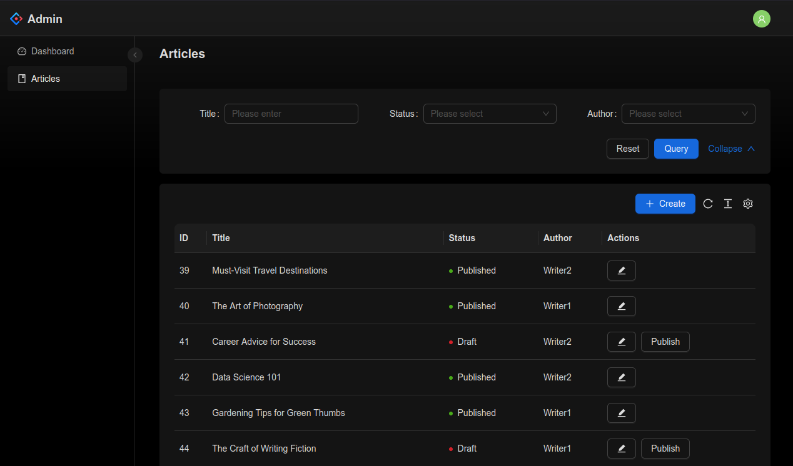
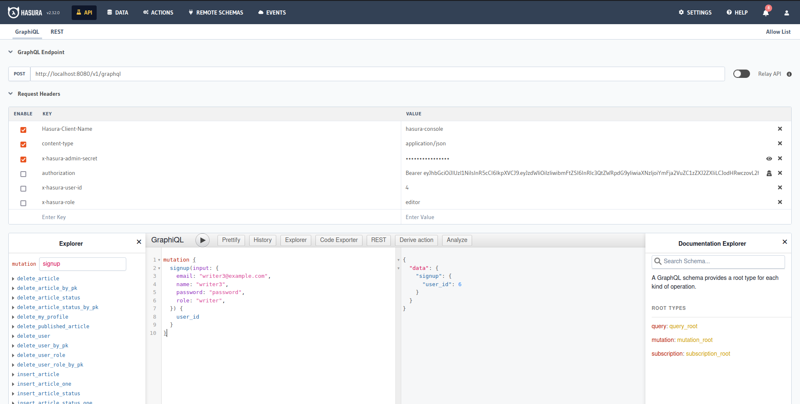
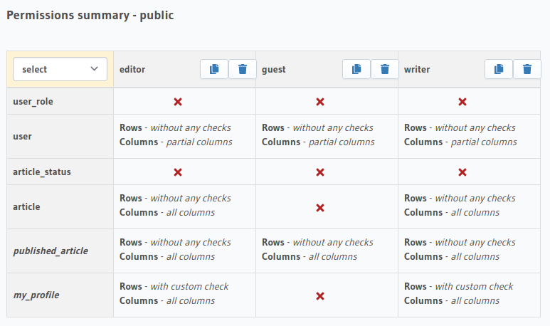
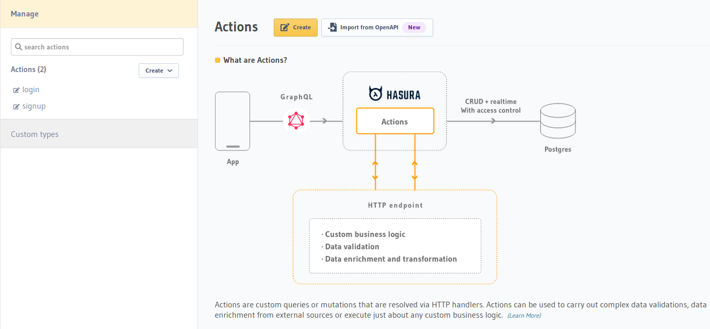
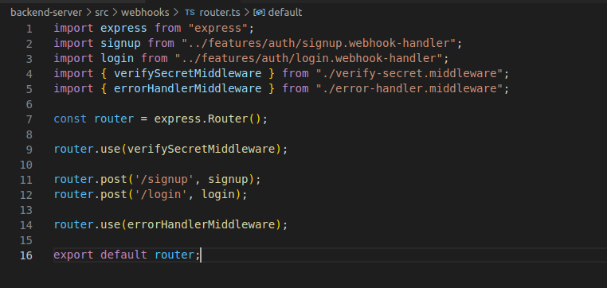

# Hasura explore

Hasura appeared to offer a promising solution for reducing time to market. In this repository, we are experimenting with Hasura to assess its potential. To do so we create a small blog application with roles and permissions.

## POC Requirements

### General
* POC is a small blog
* There are two roles writer and editor
* There should be admin ui for editors and writers

### Writers
* Writers can create article
* Writers can edit their own articles
* Writers cannot edit status field of articles
* Writers cannot delete articles
* Writers can list / read articles

### Guests
* Guest users can read articles with their author

### Editors
* Editors have full access to articles.

### Admin
* The backend api and hasura console interacts with hasura with using admin role.
* Admin has full access to every resource.

### Authentication
* Signup and login are handled via custom actions
* Signup and login requests are proxied to backend server
* Backend server created jwt in format that hasura understands
* After login / signup hasura performs authentication / authorization using jwt
* Signup is only available from hasura console
* Login is available through admin ui.

### Backend server
* Its written in typescript + express.
* It provided webhooks that hasura invokes for handling actions.
* Its uses urql graphql client to interact with the hasura server.
* It handles hasura errors.
* Uses graphql codegen to autogenerate types.

### Admin ui
* Offers login and crud for articles.
* It handles hasura errors.
* Uses graphql codegen to autogenerate types.

## Getting Started
[Getting Started](docs/getting-started.md)

## Screenshots
| | |
|:-------------------------:|:-------------------------:|
|  Login |  CRUD |
|  GraphQL API |  Permissions Summary | 
|  Custom Actions |  Action Handlers | 

## Pros
* It's basically a GraphQL to SQL compiler.
* Lets us develop a GraphQL API very quickly.
* Rich permissions model. Can easily handle complex permission requirements, even complex permissions for multi-tenant software can be handled easily.
* For things that Hasura cannot do out of the box, such as integrating with third-party APIs, etc., it's very easy to write custom webhook handlers.
* Can trigger webhooks on insert, delete, update. This can be very useful for modeling async flows.
* Modeling relationships between entities is very easy.
* Can query data not only from tables but also from views.

## Cons
*  It maps one-to-one with your database models, although database views can solve this problem, but for many applications, API models don't directly map to database models.
* If your data model has a lot of computed fields, Hasura is probably the wrong choice. Think of something like e-commerce with multi-currency support.
* Error handling feels inconvenient. It's not a Hasura problem; it's a GraphQL problem. But since we have no control over how Hasura formats errors, error handling code on the client becomes complicated.
* The enums you have in Hasura cannot be used as input to custom actions.
* There is a lot more code on the frontend, such as code generation, fragments, etc.